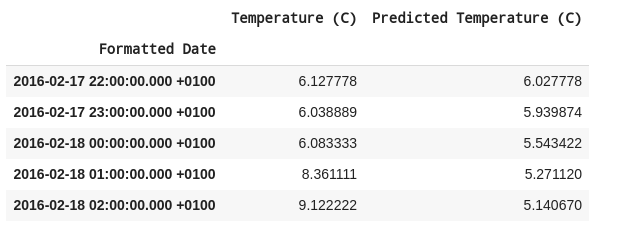

# weather_analysis_RNN  
  
This is a <strong>time series forecasting project</strong> focusing on the weather data of Szeged, Hungary.  
Source file is available on Kaggle: https://www.kaggle.com/budincsevity/szeged-weather  
  
The dataset consists of 10 years of weather data for this location on an hourly basis, including temperature, wind, humidity and pressure data among others.  
  
The main objective is to give a prediction based on the historical data.

I used some ideas from this article: https://medium.com/analytics-vidhya/weather-forecasting-with-recurrent-neural-networks-1eaa057d70c3

I used LSTM layers with Keras Sequential API.  
The model predicts the next 5 days' temperature based on the previous 90 days' temperature data.  
  

Here are the results:  
  
  
The model can be improved further for example by:
<ul>
  <li>changing the number of epochs</li>
  <li>increasing the input data which the prediction is based on (e.g. 150 days instead of 90)</li>
  <li>adding more layers to the model</li>
</ul>
